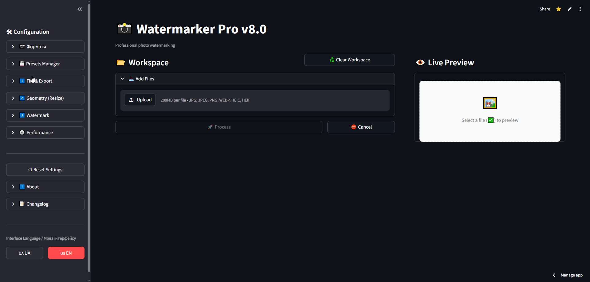

# Watermarker Pro v7.0

[](https://opensource.org/licenses/MIT)
[](https://www.python.org/)
[](https://streamlit.io)
[](https://python-pillow.org/)

**Потужний інструмент для пакетного додавання водяних знаків (текст + PNG-логотип) на зображення.**

Watermarker Pro — це швидкий, надійний і зручний веб-додаток на базі Streamlit + Pillow. Підтримує тисячі файлів, live-прев’ю, вбудований редактор, пресети та EXIF.

### ✨ Ключові можливості
- Текстова та графічна водяна мітка
- Вбудований редактор (crop, rotate, resize)
- Пресети налаштувань (збереження/завантаження)
- Багатопотокова обробка (до 8 потоків)
- Підтримка WEBP, JPEG, PNG, TIFF
- Повна валідація + захист від пошкоджених файлів
- Логування та детальна статистика

### Скріншоти




### 🚀 Швидкий старт

```bash
git clone https://github.com/MaanAndrii/watermarker-pro.git
cd watermarker-pro
pip install -r requirements.txt
streamlit run web_app.py
